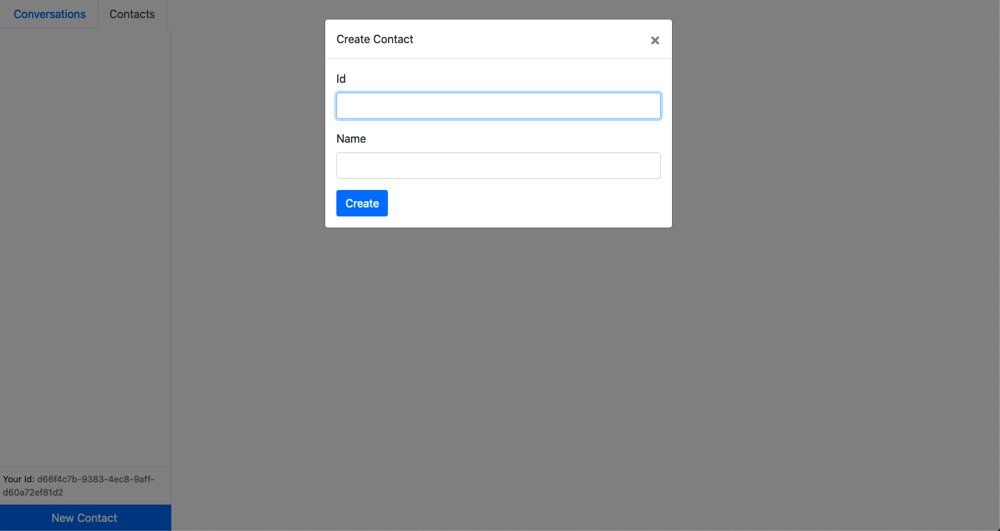
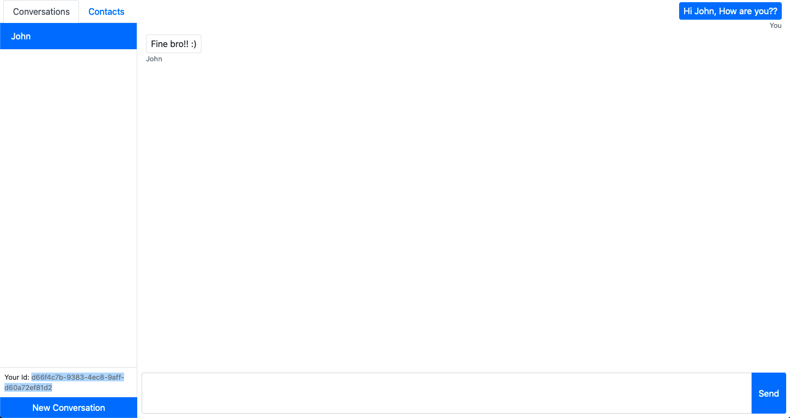

# Chating Web App

## How to install
1) Clone this repo
2) git clone repo_url
3) cd repo_folder
4) cd client
5) $ npm install && ..
6) cd server && npm install
7) Then start the server and react app

## Project OverView

  
  

